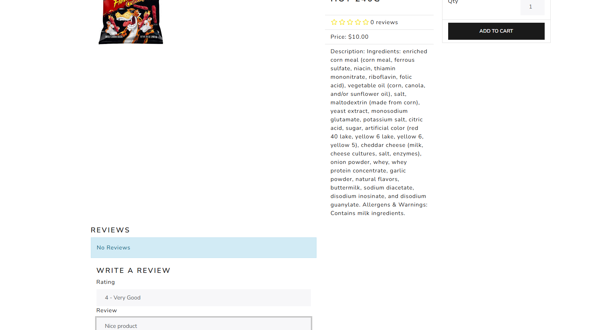
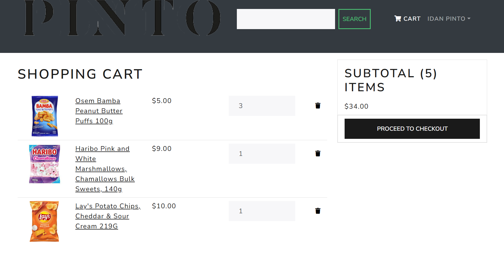
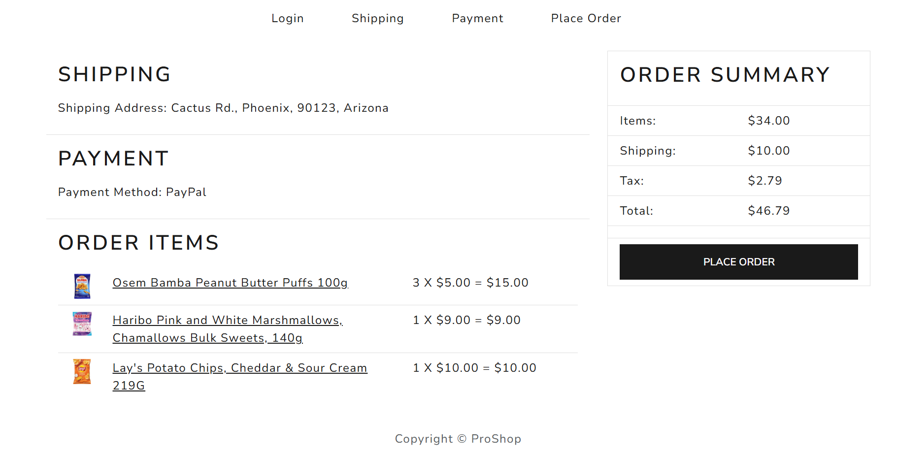
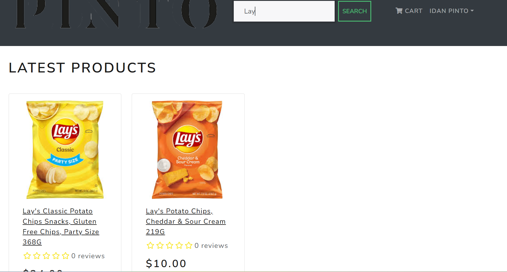

<h1 align=center>Candies and Snacks E-Commerce Website with Django + React & Redux</h1>

## ✨ About the project

This is a full-stack e-commerce web application built with Django, React, and Redux. It provides a comprehensive set of features for both customers and administrators to buy and sell candies and snacks.

### How to Run 🏃‍♀️

#### Locally

```shell
# Clone this repository
git clone https://github.com/pintop9/devops-course-final-project.git

# Navigate to the project directory
cd devops-course-final-project

# Create a virtual environment
python3 -m venv env

# Activate the virtual environment
source env/bin/activate

# Install the dependencies
pip install -r requirements.txt

# Run the development server
python3 manage.py runserver
```

#### With Docker

```shell
# Clone this repository
git clone https://github.com/pintop9/devops-course-final-project.git

# Navigate to the project directory
cd devops-course-final-project


# Run the containers and build the images in one command
docker-compose up
```

### Deploy to AWS with Terraform 🚀

This project can be deployed to AWS Cloud using Terraform. This will provision a Jenkins master and a Jenkins agent instance.

#### Prerequisites

*   **AWS Account:** Ensure you have an active AWS account.
*   **AWS CLI Configured:** Configure your AWS CLI with appropriate credentials and a default region.
*   **Terraform:** Install Terraform on your local machine.
*   **SSH Key:** Ensure you have an SSH key named `aws_tf` in the region specified in `main.tf` (il-central-1). You can create one via the AWS EC2 console if you don't have one.

#### Deployment Steps

1.  **Initialize Terraform:**
    Navigate to the root of the project where `main.tf` is located and initialize Terraform.
    ```bash
    terraform init
    ```

2.  **Review the Plan (Optional but Recommended):**
    See what Terraform will provision before actually creating resources.
    ```bash
    terraform plan
    ```

3.  **Apply the Configuration:**
    Execute the Terraform configuration to provision the AWS resources.
    ```bash
    terraform apply --auto-approve
    ```
    This will output the public IP addresses of the Jenkins master and agent. Make a note of them.

#### Post-Deployment Configuration

After Terraform successfully provisions the instances, you need to perform a few manual steps to connect the Jenkins master and agent:

1.  **Retrieve Jenkins Master's Public SSH Key:**
    SSH into the Jenkins master instance (using the `aws_tf` key and its public IP) and retrieve the public key for the `jenkins` user:
    ```bash
    sudo cat /var/lib/jenkins/.ssh/id_rsa.pub
    ```
    Copy the entire output (it starts with `ssh-rsa ...`).

2.  **Add Master's Public Key to Agent:**
    
    The `aws_tf` key is for *your* SSH access to *both* instances. The `jenkins` user's key (generated on the master) is for the *Jenkins master* to access the *Jenkins agent*.

    SSH into the Ubuntu agent instance (using the `aws_tf` key and its public IP). Then, as a user with `sudo` privileges, execute the following commands.
    ```bash
    echo "<JENKINS_MASTER_PUBLIC_KEY>" | sudo tee -a /home/jenkins/.ssh/authorized_keys
    sudo chown jenkins:jenkins /home/jenkins/.ssh/authorized_keys
    sudo chmod 600 /home/jenkins/.ssh/authorized_keys
    ```
    Replace `<JENKINS_MASTER_PUBLIC_KEY>` with the actual public key you copied from the master.

3.  **Access Jenkins UI and Configure Agent:**
    *   Open your web browser and navigate to `http://<JENKINS_MASTER_PUBLIC_IP>:8080` (replace `<JENKINS_MASTER_PUBLIC_IP>` with the actual IP).
    *   Follow the Jenkins setup wizard. You will need to get the initial admin password from the master instance's logs.
    *   Once Jenkins is set up, go to "Manage Jenkins" -> "Nodes" -> "New Node".
    *   Create a new permanent agent.
    *   Configure the node with the following:
        *   **Host:** The public IP of your Ubuntu agent instance.
        *   **Credentials:** Add new SSH credentials.
            *   **Scope:** System
            *   **ID:** (choose a unique ID, e.g., `jenkins-agent-ssh-key`)
            *   **Description:** (e.g., `SSH key for Jenkins agent`)
            *   **Username:** `jenkins`
            *   **From the Jenkins master, get the private key by running:**
                ```bash
                sudo cat /var/lib/jenkins/.ssh/id_rsa
                ```
                Paste the entire content of the private key into the "Private Key" field in Jenkins.
        *   **Host Key Verification Strategy:** Select "Non verifying Verification Strategy" (for simplicity in a development environment, but not recommended for production).
        *   **Launch method:** Launch agent via SSH.
        *   **Remote root directory:** `/home/jenkins`
    *   Save the configuration. Jenkins master should now connect to the agent.

### 📷 Project Screenshots








### 🚀 Project Features

A completely customized eCommerce / shopping cart application using Django, REACT and REDUX with the following functionality:

- Full featured shopping cart
- Product reviews and Ratings
- Top products carousel
- Product pagination
- Product search feature
- User profile with orders
- Admin product management
- Admin user management
- Admin Order details page
- Mark orders as a delivered option
- Checkout process (shipping, payment method, etc)
- PayPal / credit card integration
